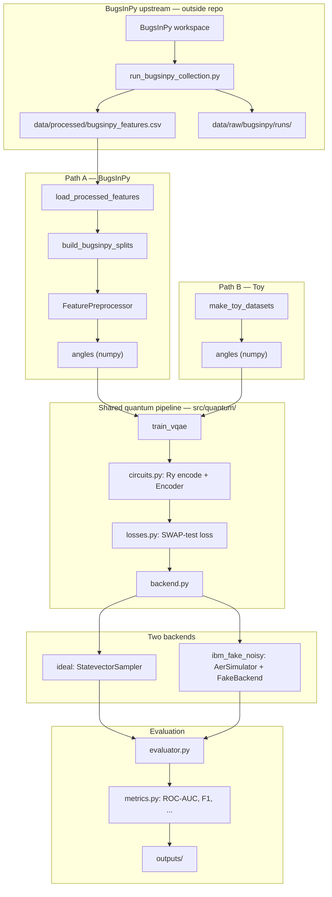
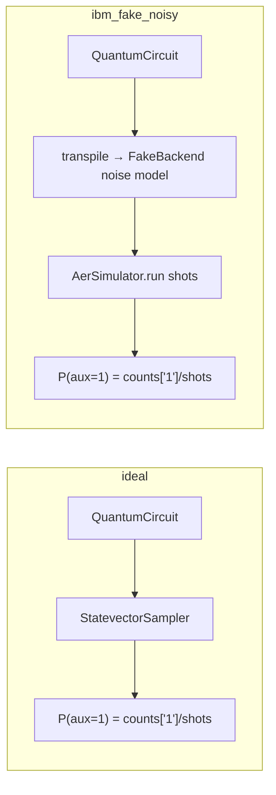

# VQAE Experiment

Variational Quantum Autoencoder (VQAE) for anomaly detection on software test execution features. The model is trained on normal (fixed-revision) executions using SWAP-test loss as a compression-quality signal, then evaluated on held-out buggy revisions.

Two data pipelines (synthetic Toy / real BugsInPy) converge on the same quantum training and evaluation code. Two quantum backends are supported: **ideal** statevector simulation and **IBM fake noisy** local simulation.

---

## Directory structure

```text
VQAE_experiment/
  README.md
  configs/                      # experiment YAML configs
    toy_ideal.yaml
    toy_ibm_noisy.yaml
    bugsinpy_sample_fast.yaml
    bugsinpy_ibm_noisy.yaml
    bugsinpy_collect.yaml       # data collection (not a VQAE run)
  scripts/
    smoke_test.py               # quick circuit / backend check
    run_toy_experiment.py         # Toy experiment entry point
    run_bugsinpy_experiment.py
    run_bugsinpy_collection.py
    run_baselines.py
  src/
    config.py
    data/                       # loading, splitting, preprocessing
    quantum/                    # circuits, training, backend, evaluation
    reporting/                  # metrics, plots, artifacts
    baselines/
  data/
    processed/                  # feature tables consumed by VQAE
    raw/bugsinpy/runs/          # small per-run logs (inside quantum-work)
    manifests/                  # train / val / test split manifests
  tests/
  outputs/                      # experiment outputs (gitignored)
```

Repository root dependency file: `requirements.txt`

External (outside `quantum-work`):

```text
MITACS/BugsInPy/                # BugsInPy tools + workspace/ (large checkouts)
```

---

## Data storage and flow

### Where data lives

```text
MITACS/BugsInPy/
  framework/bin/bugsinpy-*      # BugsInPy CLI tools
  workspace/                    # checked-out source trees (large; not in quantum-work)
      youtube-dl_1_fixed/
      youtube-dl_1_buggy/
      ...

quantum-work/VQAE_experiment/
  data/raw/bugsinpy/runs/       # per-revision artifacts
      youtube-dl_1_fixed/
        checkout/  compile/
        test_test_match_str/    # one folder per triggering test
          run/  coverage/  features.json
        aggregate/features.json # revision-level summary
  data/processed/
      bugsinpy_features.csv                 # primary test-level table (VQAE input)
      bugsinpy_features_revision_aggregate.csv  # supplementary revision aggregates
```

**Primary row unit:** one triggering test execution on one revision  
`(project, bug_id, revision, test_id)`

| Column | Role |
|--------|------|
| `project`, `bug_id`, `revision`, `test_id` | metadata (not fed to the model) |
| `granularity` | `test` for primary rows |
| `label` | 0 = normal fixed, 1 = buggy (evaluation only) |
| `test_runtime_seconds`, `coverage_ratio`, … | model input features |

Collection runs each line in BugsInPy `run_test.sh` separately via `bugsinpy-test -t` and `bugsinpy-coverage -t`.  
Only **triggering tests** are collected — not the full project test suite.

**Revision aggregate file** (`bugsinpy_features_revision_aggregate.csv`) stores one row per revision with `mean_*/std_*/min_*/max_*` feature summaries and `pass_rate`. Use it for supplementary experiments, not the main VQAE training table.

Collection script: `scripts/run_bugsinpy_collection.py`  
Command wrapper: `src/data/bugsinpy_runner.py`  
Feature parsing: `src/data/bugsinpy_features.py`

Before a BugsInPy experiment, `src/data/splits.py` → `build_bugsinpy_splits()` writes:

```text
data/manifests/
  train_manifest.csv        # fixed only, label=0 (training)
  validation_manifest.csv   # fixed only, label=0 (threshold selection)
  test_manifest.csv         # held-out bugs: fixed + buggy (final evaluation)
```

Splits are grouped by `(project, bug_id)` so all tests from the same bug stay in the same split (no leakage across train/test).

Toy data is not stored as CSV; `src/data/synthetic.py` → `make_toy_datasets()` generates angle matrices at runtime.

### End-to-end pipeline



### How the two data paths merge

| Stage | Toy | BugsInPy | Convergence point |
|-------|-----|----------|-------------------|
| Load data | `synthetic.py` | `bugsinpy_features.py` + `splits.py` | — |
| To angles | already angles | `preprocessing.py` (Scaler → [0, π]) | `numpy` angle matrix |
| Train | | | `trainer.py` → `train_vqae()` |
| Circuits | | | `circuits.py` |
| Loss | | | `losses.py` |
| Execute | | | `backend.py` |
| Evaluate | | | `evaluator.py` + `metrics.py` |
| Output | | | `reporting/` → `outputs/` |

Entry scripts:

- Toy: `scripts/run_toy_experiment.py`
- BugsInPy: `scripts/run_bugsinpy_experiment.py`

---

## Installation

```powershell
cd <repo-root>
python -m pip install -r requirements.txt
python VQAE_experiment/scripts/smoke_test.py
python -m pytest VQAE_experiment/tests/ -v
```

---

## Experiments

| Config | Script | Data | Backend | Purpose |
|--------|--------|------|---------|---------|
| `toy_ideal.yaml` | `run_toy_experiment.py` | synthetic Toy | **ideal** | pipeline upper bound |
| `toy_ibm_noisy.yaml` | `run_toy_experiment.py` | synthetic Toy | **ibm_fake_noisy** | Toy under noise |
| `bugsinpy_sample_fast.yaml` | `run_bugsinpy_experiment.py` | BugsInPy CSV | **ibm_fake_noisy** | fast real-data run |
| `bugsinpy_ibm_noisy.yaml` | `run_bugsinpy_experiment.py` | BugsInPy CSV | **ibm_fake_noisy** | full real-data settings |
| `bugsinpy_collect.yaml` | `run_bugsinpy_collection.py` | — | WSL + BugsInPy | collect features into CSV |

```powershell
# Toy
python VQAE_experiment/scripts/run_toy_experiment.py --config VQAE_experiment/configs/toy_ideal.yaml
python VQAE_experiment/scripts/run_toy_experiment.py --config VQAE_experiment/configs/toy_ibm_noisy.yaml

# BugsInPy (requires processed CSV)
python VQAE_experiment/scripts/run_bugsinpy_experiment.py --config VQAE_experiment/configs/bugsinpy_sample_fast.yaml
python VQAE_experiment/scripts/run_bugsinpy_experiment.py --config VQAE_experiment/configs/bugsinpy_ibm_noisy.yaml

# Collection (triggered on Windows, executed in WSL via BugsInPy)
$env:BUGSINPY_ROOT = "C:\path\to\BugsInPy"
python VQAE_experiment/scripts/run_bugsinpy_collection.py --config VQAE_experiment/configs/bugsinpy_collect.yaml
```

---

## Classical features → quantum states

| Step | File | Function |
|------|------|----------|
| Load CSV | `src/data/bugsinpy_features.py` | `load_processed_features()` |
| Split | `src/data/splits.py` | `build_bugsinpy_splits()` |
| Features → angles | `src/data/preprocessing.py` | `FeaturePreprocessor.fit_transform()` |
| Ry encoding | `src/quantum/circuits.py` | `build_input_encoding_circuit()` |
| Variational encoder | `src/quantum/circuits.py` | `build_encoder_circuit()` |
| SWAP-test circuit | `src/quantum/circuits.py` | `build_swap_test_circuit()` |
| Execute circuit | `src/quantum/backend.py` | `BackendRunner.run_*()` |

### Qubit layout (BugsInPy: 4 input / 2 latent / 2 trash)

```text
After encoding:
  q0, q1  = latent (information retained)
  q2, q3  = trash (should be compressed to |0⟩)

SWAP-test adds:
  q4, q5  = reference |0⟩
  q6      = auxiliary (measured → loss)
```

Toy uses 2 input / 1 latent / 1 trash (4-qubit SWAP circuit total).

---

## Quantum backends

Both backends are created in **`src/quantum/backend.py`** via `create_backend_runner(mode=...)`.  
This is **not** IBM Cloud hardware; `ibm_fake_noisy` = IBM device noise model + local Aer simulation.



| | **ideal** | **ibm_fake_noisy** |
|--|-----------|---------------------|
| Implementation | `StatevectorSampler` | `AerSimulator.from_backend(FakeXxx)` |
| Noise | none | yes (depolarizing, readout, etc.) |
| Typical use | `toy_ideal`; diagnostics | `toy_ibm_noisy`, `bugsinpy_*` |
| Training mode | `training_mode: ideal_training` | `training_mode: noisy_training` |
| Fake device | — | `fake_manila` (5q, toy), `fake_sherbrooke` (7q, BugsInPy) |

Backend selection during training: `src/quantum/trainer.py` → `_resolve_training_backend()`

SWAP loss (same on both backends): `P(auxiliary measured as 1)`, see `src/quantum/losses.py`.

---

## Training logic (unsupervised anomaly detection)

```text
Train:      fixed revisions only, label=0
            → COBYLA minimizes mean SWAP-test loss
            → learns how normal executions compress

Validation: normal samples only → threshold (default 95th percentile)

Test:       normal fixed + buggy scored together
            → ROC-AUC / F1 from labels (labels never fed to the model)
```

Training entry: `src/quantum/trainer.py` → `train_vqae()`  
Optimization target: `src/quantum/losses.py` → `mean_swap_test_loss()`

There is no separately trained decoder; compression quality is measured indirectly via SWAP-test on trash qubits.  
Ideal reconstruction fidelity diagnostics (toy + ideal evaluation only): `src/quantum/diagnostics.py`.

---

## Output directory

Each run creates:

```text
outputs/{experiment_name}_{YYYYMMDD_HHMMSS}/
  config_used.yaml           # config snapshot
  reproducibility.json       # Python / Qiskit versions
  training_metrics.json      # training summary
  figures/
  tables/
```

### `training_metrics.json`

| Field | Meaning |
|-------|---------|
| `success` | whether the optimizer converged |
| `optimizer_evaluations` | number of COBYLA evaluations |
| `training_time_seconds` | wall-clock training time |
| `final_training_loss` | mean SWAP loss at end of training |
| `backend_mode` | ideal / ibm_fake_noisy |

### `figures/`

| File | Meaning |
|------|---------|
| `loss_curve.png` | training loss vs iteration |
| `swap_score_histogram.png` | normal vs anomalous SWAP loss distribution |
| `swap_score_roc.png` | ROC curve |
| `precision_recall_curve.png` | precision–recall curve |

### `tables/anomaly_metrics.csv` (all experiments)

| Column | Meaning |
|--------|---------|
| `threshold` | anomaly threshold (validation normal-score quantile) |
| `accuracy`, `precision`, `recall`, `f1` | classification metrics |
| `roc_auc` | area under ROC (1 = perfect, 0.5 = random) |
| `pr_auc` | area under PR curve |
| `false_positive_rate` | fraction of normals flagged as anomalous |
| `recall_at_5pct_fpr` | recall at FPR ≤ 5% |
| `noise_seed` | noise-simulation seed (multiple rows for noisy runs) |

### `tables/` — Toy experiments only

| File | Meaning |
|------|---------|
| `sample_scores.csv` | per-sample angles, SWAP loss, ideal diagnostics |
| `loss_history.csv` | loss per optimizer iteration |
| `final_parameters.csv` | trained encoder parameters θ |

---

## Experiment design

### Toy synthetic data

Normal: `x1 = x2 ~ N(0.5, 0.05²)` (correlated 2D angles)  
Anomalous: break correlation near the same mean: `x1 = x ± δ`, `x2 = x ∓ δ`

### Encoder (`src/quantum/circuits.py`)

Each layer: `Ry` on all qubits → adjacent `CNOT` chain.  
Trainable parameters θ: `n_input_qubits × ansatz_depth`.

### SWAP-test compression loss

```text
H(aux) → CSWAP(aux, trash_i, ref_i) → H(aux) → measure aux
loss = P(aux = 1)
```

- trash near |0⟩ → low loss (good compression)
- trash still carries information → high loss → flagged as anomalous at test time

---

## Data volume and splits (current default: 8 BugsInPy bugs)

| Split | Approx. size | Contents |
|-------|--------------|----------|
| Train | 4 rows | fixed revision from 4 bugs |
| Validation | 1 row | fixed revision from 1 bug |
| Test | 6 rows | 3 fixed + 3 buggy (held-out bugs) |

The 16-row CSV is suitable for pipeline smoke tests. For more stable conclusions, expand `selected_bug_ids` in `bugsinpy_collect.yaml` and re-collect:

```powershell
python VQAE_experiment/scripts/run_bugsinpy_collection.py --config VQAE_experiment/configs/bugsinpy_collect.yaml --skip-existing
```

---

## Code navigation (execution order)

```text
1. scripts/run_*_experiment.py     entry points
2. src/config.py                   load YAML
3. src/data/                       load, split, preprocess
4. src/quantum/trainer.py          training
5. src/quantum/circuits.py         quantum circuits
6. src/quantum/losses.py           SWAP loss
7. src/quantum/backend.py          simulation
8. src/quantum/evaluator.py        test scoring
9. src/reporting/metrics.py        ROC-AUC, etc.
10. src/reporting/plots.py         figures
11. src/reporting/artifacts.py     write outputs
```

---

## Notes

- `ibm_fake_noisy` requires `qiskit-aer` and `qiskit-ibm-runtime` (fake provider).
- The BugsInPy 4-input VQAE SWAP circuit needs **7 qubits**; `fake_manila` (5q) is insufficient — use `fake_sherbrooke`.
- `data/raw/`, `data/manifests/`, and `outputs/` are in `.gitignore`; large checkouts live in `MITACS/BugsInPy/workspace/`.
- Collection on Windows routes BugsInPy through WSL; with `command_prefix: []` the script auto-detects WSL.
